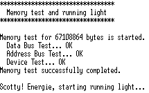

## de10l-neorv32-sdram-qsys

#### Project information:

| Board   | [Terasic DE10-Lite](https://www.terasic.com.tw/cgi-bin/page/archive.pl?Language=english&No=1021) |
| :------ | :---------- |
| FPGA    | MAX10 `10M50DAF484C7G` |
| Quartus | 15.0.2      |
| clk_i   | 90 MHz     |

#### Memory Address Map:

| Region  | Start Address | End Address | Size (bytes) | Description |
| :------ | :------------ | :---------- | :----------- | :---------- |
| IMEM    | 0x00000000    | 0x0000FFFF  | 64K          | TCM On-chip RAM |
| DMEM    | 0x80000000    | 0x80007FFF  | 32K          | TCM On-chip RAM |
| QSYS    | 0x90000000    | 0x9FFFFFFF  | 256MB        | Accessible via the Wishbone to Avalon Master |

#### Qsys Address Map:

| Region  | Start Address | End Address | Size (bytes) | Description |
| :------ | :------------ | :---------- | :----------- | :---------- |
| SDRAM   | 0x00000000    | 0x03FFFFFF  | 64MB         |  |

The SDRAM starts in the Qsys area from address 0x00000000. But since the Qsys area 
in the CPU is starting at 0x90000000, the SDRAM can be reached by the CPU at address 
0x90000000 + 0x0000000. 

## Description

This is a simple example using on-chip RAM as memory for IMEM and DMEM. In addition, 
there is the SDRAM which can be addressed by the Wishbone to Avalon Master in the Qsys area.

A memory test was also implemented. The terminal output looks like:

## Embedded Studio for RISC-V

A description of how to use Embedded Studio for RISC-V will be available soon.