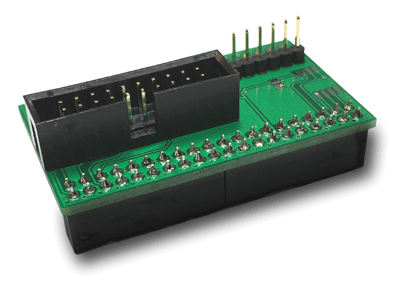

# neorv32-examples

Some neorv32 examples for Intel FPGA boards using Quartus II and SEGGER Embedded Studio for RISC-V.

| Board | Family | clk_i | IMEM | DMEM | SDRAM |
| :---- | :----- | ----: | ---: | ----:| ----: |
| [DE10-Lite](https://www.terasic.com.tw/cgi-bin/page/archive.pl?Language=english&No=1021)               | MAX10 `10M50DAF484C7G`         |  90 MHz |  64KB |  32KB | 64MB |
| [DE0-Nano](https://www.terasic.com.tw/cgi-bin/page/archive.pl?Language=English&CategoryNo=139&No=593)  | Cyclone IV `EP4CE22F17C6N`     | 100 MHz |  32KB |  16KB | 32MB |
| [DE0-CV](https://www.terasic.com.tw/cgi-bin/page/archive.pl?Language=English&CategoryNo=167&No=921)    | Cyclone V `5CEBA4F23C7N`       | 100 MHz | 128KB |  64KB | 64MB |
| [Cyclone V GX Starter Kit](https://www.terasic.com.tw/cgi-bin/page/archive.pl?Language=English&No=830) | Cyclone V GX `5CGXFC5C6F27C7N` |  90 MHz | 256KB | 128KB |  0MB |

NEORV32 submodule removed because it will not downloaded in case of "Code > Download ZIP". That is why NEORV32 has now been integrated directly.

For the easier use of JTAG and a FTDI UART adapter there is now the "JTAG Terasic Adapter" available:

A [Schematic](./doc/fpgajtag.pdf "Schematic") and the [Gerber](./doc/fpgajtag.zip "Gerber") files are also available.
